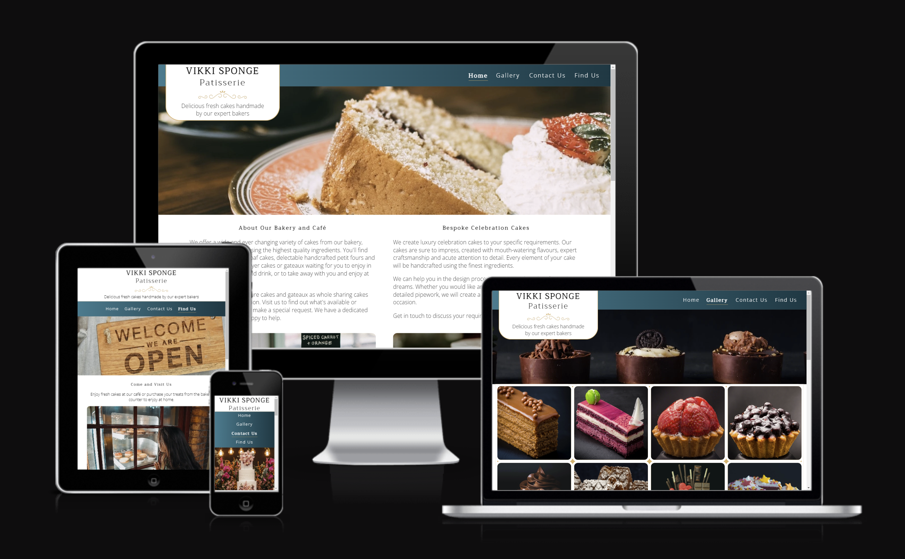
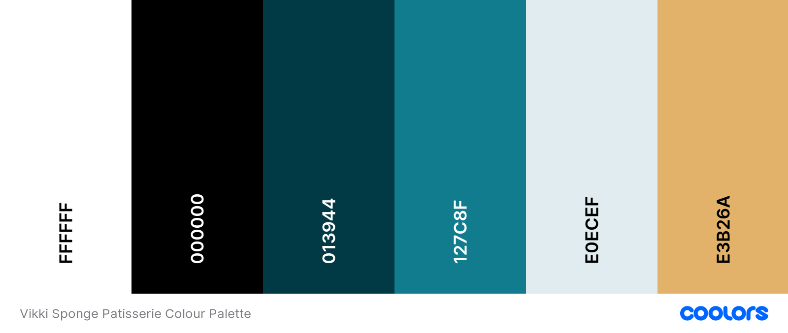

# Vikki Sponge Patisserie

Vikki Sponge Patisserie is a bakery and cafe providing fresh cakes and drinks available for purchase to eat in the café or takeaway. The bakery also provides a range of celebration cakes available to order and a custom cake service.

The website is designed to be a responsive website that can be accessed and easily viewed on a range of screen sizes. The sites primary audience will be customers interested in learning more about the bakery before visiting or making an enquiry about making an order. It will provide information about the business and the variety of products available for purchase.

[The deployed website can be found here](https://victoriaparkes.github.io/MS1-Vikki-Sponge-Patisserie/)

# Contents
1. [User Experience (UX)](#1-user-experience-ux)
    - [User Stories](#user-stories)
        - [Customers](#customers)
        - [Business Owner](#business-owner)
2. [Features](#2-features)
    - [Current Features](#current-features)
    - [Future Features](#future-features)
3. [Design](#3-design)
    - [Structure](#structure)
    - [Wireframes](#wireframes)
    - [Colour Scheme](#colour-scheme)
    - [Typography](#typography)
    - [Imagery](#imagery)
    - [Icons](#icons)
4. [Technologies Used](#4-technologies-used)
5. [Testing](#5-testing)
    - [Functionality Testing](#functionality-testing)
    - [Browser Compatibility](#browser-compatibility)
    - [W3C HTML Validator Testing](#w3c-html-validator-testing)
    - [W3C CSS Validator Testing](#w3c-css-validator-testing)
    - [Lighthouse Reports](#lighthouse-reports)
    - [Bugs Encountered](#bugs-encountered)
        - [Fixed](#fixed)
        - [Unfixed](#unfixed)
6. [Deployment and Local Development](#6-deployment-and-local-development)
    - [Deployment](#deployment)
    - [Local Development](#local-development)
        - [Forking the Repository](#forking-the-repository)
        - [Cloning Your Forked Repository](#cloning-your-forked-repository)
7. [Credits](#7-credits)
    - [Code](#code)
    - [Content](#content)
    - [Media](#media)
    - [Acknowledgements](#acknowledgements)

---

# 1. User Experience (UX)
## User Stories
### Customers
As a customer I would like:
- To learn about the bakery and cafe.
- To find out what kind of products and services are provided.
- To find information about the location of the bakery.
- To be able to contact the bakery.
- To view social media pages.
- To be able to clearly view the website on any device.

### Business Owner
As the business owner I would like:
- To promote the bakery as a modern business providing high quality products.
- To display a variety of products regularly available for purchase at the bakery.
- To display examples of custom cakes available to order.
- To provide information about what services are provided.
- To provide information about the location of the bakery.
- To provide means of contact for customers to make enquiries.
- To provide links to the businesses social media pages.
- For the website to be accessible and easily viewed on any device.

---

# 2. Features
## Current Features
The website has four pages (a 'Home' page, a 'Gallery' page, a 'Contact Us' page and a 'Find Us' page) which are all easily accessed via the navigation menu. 

All pages feature:
- A responsive header with:
    - A logo which is a link to the 'Home' page allowing users to easily navigate to the 'Home' page from any other page.
    - The website cover text giving users a brief description of and promoting what the business offers. This is removed on screens up to 600px wide to avoid a cluttered appearance.
    - The navigation menu with links to each page which allows users to easily navigate from page to page across all devices without having to navigate backwards to previously visited pages.
    - A different background image for each page to provide visual interest that is relevant to the page content. The background images are responsive to screen width to ensure the focal point is centred and the image fits well on all screen sizes.

- A footer with:
    - A responsive form used to sign up to a newsletter containing input fields in which the user is required to enter their name and email address in order to submit the form. The user submits this information using the 'sign up' submit button. Signing up to a newsletter allows the business to provide its customers with any news, updates or special offers.
    - Social media icon links to Facebook, Twitter and Instagram which open in a new browser tab, allowing customers to view and participate in any activity on social media platforms.

The 'Home' page features:
- Information about the bakery and café, briefly detailing the services available to customers in store and information about the custom cake service provided.
- A review section displaying customer 5 star ratings using star icons and their review of the bakery.

The 'Gallery' page features:
- Images of a selection of products available to purchase at the bakery and examples of custom celebration cakes created for previous customers. These images promote the products available at the bakery and give the user an idea of what is offered.
- An embedded YouTube video of a celebration cake being decorated as a demonstration of the skills the bakers at the company possess.

The 'Contact Us' page features:
- Different means of contacting the bakery giving the users the choice of different options.
    - Telephone number and email address for the bakery.
    - A contact form containing:
        - A text input fields in which the user is required to enter their name in order to submit the form.
        - An email input field in which the user is required to enter their email address in order to submit the form.
        - A telephone input for the user to enter their telephone number.
        - A dropdown input for the user to select an option for what type of event they require a cake for if applicable.
        - A date input field for the user to enter a date they would require a cake.
        - A text area input field in which the user is required to enter their message to the bakery in order to submit the form.
        - The user submits the form using the submit button located under the message input field.

The 'Find Us' page features:
- The address of the bakery to inform users of the business location.
- The open times of the bakery to inform users of the business hours.
- A google map iframe to allow users to more easily find the bakery.

In addition to the pages for the main content of the website, a custom 404 error page was also created. This page informs the user that an error has occurred when the page they intended to view cannot be reached and it's design is consistent with the rest of the website.

## Future Features
- A thank you page or pop up message to thank the user for getting in touch via contact form upon successful submission.
- An online ordering service allowing users to order and pay for cakes online to be collected from the bakery or delivered.

---

# 3. Design

## Structure
The website comprises four pages, all of which feature the header at the top of the page and the footer at the bottom of the page.

- The header is fully responsive, the position of the elements is adjusted depending on screen size.
    - For screens over 992px wide the logo and cover text are displayed on the top left of the screen, the navigation menu is displayed across the whole width at the top of the page with the links displayed horizontally on the right, with the background image also displayed across the whole width of the page below the navigation menu.
    - For screens up to 992px wide the logo and cover text container is displayed at the top, across the whole width of the page with the text horizontally centred. The navigation menu is displayed immediately below, across the whole width of the page, with the navigation links horizontally centred. The background image is displayed below the navigation menu, across the whole width of the page.
    - For screens up to 600px wide the logo and cover text are displayed as for screens up to 992px. The navigation menu displayed below across the whole width of the page with the navigation links stacked and horizontally centred. The background image is displayed below the navigation menu as for screens up to 992px wide.
    - For visual feedback, the navigation link for the current page and any link the cursor is positioned over is displayed in a different font with an underline.

- The footer is fully responsive and includes the newsletter sign up form displayed horizontally centred with the container displayed across the whole width of the page, and the social media links displayed as icons positioned horizontally in a bar below the newsletter sign up form.
    - The height of the newsletter container adjusts to ensure the newsletter form is always displayed within the boundaries of the container and the newsletter inputs respond to screen width to remain fully displayed on the page.
    - The social media links remain displayed horizontally in a row with the space between the links adjusting dependant on screen width to maintain balance on the page.

-  The content of the 'Home' page is displayed in columns on screens over 992px wide. Information about the business is displayed in two columns with an accompanying image below each section of text on screens over 992px wide, below this the reviews are displayed in three columns. On screens up to 992px wide the content is displayed stacked vertically.

- The photos on the 'Gallery' page are displayed in a responsive column format to ensure appropriate image size and pleasing layout. On screens over 992px wide the photos are displayed in four columns, on screens up to 992px wide the photos are displayed in three columns, on screens up to 768px wide the photos are displayed in two columns and on screens up to 600px wide the photos are displayed in one column. The video is positioned centrally below the photo gallery and the size of the video is responsive to screen width to ensure the video is an appropriate size for viewing and is not larger than the viewport.

- The content of the 'Contact Us' page is displayed with headings positioned centrally on the page and the contact information and contact form displayed in a responsive column format below for consistency in style. On screens over 992px wide two columns are displayed and screens up to 992px the content is stacked to ensure appropriate sizing of the elements for good usability.

- The content of the 'Find Us' page is displayed in the same style as the 'Contact Us' page for consistency in style. The heading is positioned centrally with the image and information displayed below in two columns on screens over 992px wide and stacked on screens up to 992px wide. Below the this a google map is embedded which is displayed across the whole width of the page.

## Wireframes
- ['Home' Page Wireframe](docs/wireframes/home-wireframe.png)
- ['Gallery' Page Wireframe](docs/wireframes/gallery-wireframe.png)
- ['Contact Us' Page Wireframe](docs/wireframes/contact-wireframe.png)
- ['Find Us' Page Wireframe](docs/wireframes/find-wireframe.png)

## Colour Scheme

The colour scheme was chosen to complement the colours in the images, frame the pages of the website and provide contrast for good readability of the information.
The colour palette was created using [Coolors](https://coolors.co/).

## Typography
[Google Fonts](https://fonts.google.com/) was used to add the following fonts:
- 'Trirong' is used for headings and to provide visual contrast for navigation links when in use.
- 'Open sans' is used for the body text of the site, this is a clean and easy to read font.
- 'Sans serif' is used as a fallback font in the event the font cannot be imported into the site correctly.

[Fontjoy](https://fontjoy.com/) was used to choose fonts that have good visual contrast.

## Imagery
The images used in the website were chosen to reflect the content of the pages and the information they accompany. They are intended to promote the products and services provided by the business and entice users to become customers.

The 'Gallery' page images were selected for the close up format and the dark background of the images to ensure the focus is on the products and provide consistent style in the gallery. These images are displayed with a ratio of 1:1 to provide a clean layout across all sizes of device.

## Icons
Icons were used as visual indicators for the social media links, star ratings and contact details.

All icons were sourced from [Font Awesome](https://fontawesome.com/)

---

# 4. Technologies Used
HTML - to create the structure of the website.

CSS - to add style to the website.

[Chrome DevTools](https://developer.chrome.com/docs/devtools/) - used to help test features and for debugging.

[Google Fonts](https://fonts.google.com/) - a fonts library.

[Font Awesome](https://fontawesome.com/) - for iconography used on the website.

[Git](https://git-scm.com/) - for version control.

[GitHub](https://github.com/) - to create and store the project repository.

[GitPod](https://gitpod.io/) - development hosting platform used to create the website.

[Balsamiq](https://balsamiq.com/) - used to create Wireframes for the layout of the pages.

[Coolors](https://coolors.co/) - used to create the colour palette.

[Pexels](https://www.pexels.com/) - used to source images.

[Unsplash](https://unsplash.com/) - used to source images.

[Rawpixel](https://www.rawpixel.com/) - used to source images.

[Microsoft Photos](https://apps.microsoft.com/store/detail/microsoft-photos/9WZDNCRFJBH4) - used to edit images.

[CloudConvert](https://cloudconvert.com/) - used to convert images to webp format.

[Tiny PNG](https://tinypng.com/) - used to compress images.

[Am I Responsive](https://ui.dev/amiresponsive) - To view the website on a range of devices and create the mock-up screenshot image.

[The W3C Markup Validation Service](https://validator.w3.org/) - Used to validate HTML files.

[The W3C CSS Validation Service](https://jigsaw.w3.org/css-validator/) - Used to validate the CSS file. 

---

# 5. Testing
[Chrome DevTools](https://developer.chrome.com/docs/devtools/) was frequently utilised in the development of the website to manipulate and test features as they were added to the project, to test responsiveness and for debugging purposes.

## Functionality Testing

[See Functionality Testing Document](docs/testing/functionality-testing.md)

## Browser Compatibility
The website was tested for functionality on different browsers (Chrome, Firefox and Edge) and found to be fully functional on them all.

## W3C HTML Validator Testing
The W3C validator service was used to validate the HTML on all pages of the website. All errors and warnings flagged by the validator service were addressed and the pages were resubmitted for validation.

## 'Home' Page
['Home' page initial validation report](docs/testing/validator-screenshots/index-html-validator-warning.png)

['Home' page final validation report](docs/testing/validator-screenshots/index-html-validator-passed.png)

## 'Gallery' Page
['Gallery' page initial validation report](docs/testing/validator-screenshots/gallery-html-validator-error-warning.png)

['Gallery' page final validation report](docs/testing/validator-screenshots/gallery-html-validator-passed.png)

## 'Contact Us' Page
['Contact Us' page initial validation report](docs/testing/validator-screenshots/contact-html-validator-error-warning.png)

['Contact Us' page final validation report](docs/testing/validator-screenshots/contact-html-validator-passed.png)

## 'Find Us' Page
['Find Us' page initial validation report](docs/testing/validator-screenshots/find-html-validator-error-warning.png)

['Find Us' page final validation report](docs/testing/validator-screenshots/find-html-validator-passed.png)

## 404 Error Page
[404 Error page validation report](docs/testing/validator-screenshots/404-html-validator-passed.png)

## W3C CSS Validator Testing

The W3C validator service was used to validate the CSS in the stylesheet. All errors and warnings flagged by the validator service were addressed and the file was resubmitted for validation.

[CSS initial validation report](docs/testing/validator-screenshots/css-validator-ratio-value-error.png)
[CSS final validation report](docs/testing/validator-screenshots/css-validator-passed.png)

## Lighthouse Reports
I frequently used Lighthouse in the Chrome Developer Tools to allow me to test the performance, accessibility, best practices and SEO of the website during the development of the website. Images were converted to webp format as suggested in a Lightouse report performed after implementing the photo gallery feature and compressed to improve performance.

Final Lighthouse reports are as follows:

### 'Home' Page - Mobile

### 'Home' Page - Desktop

### 'Gallery' Page - Mobile

### 'Gallery' Page - Desktop

### 'Contact Us' Page - Mobile

### 'Contact Us' Page - Desktop

### 'Find Us' Page - Mobile

### 'Find Us' Page - Desktop

### 404 Error Page - Mobile

### 404 Error Page - Desktop

## Bugs Encountered
### Fixed
1. When the browser font-size was increased the logo and cover text were overlapping and unable to be read proving an accessibility issue. The problem was fixed by moving the html cover text elements to the same container as the logo which resulted in a clean and readable display of the text when the browser font-size was increased.
2. When the browser font-size was increased the newsletter sign up form exceeded the edges of its container. This issue was fixed by making the height on the container a minimum height value.
3. When the 'Gallery' page was viewed on a larger desktop screen size, the size if the video exceeded the screen size. This issue was fixed by setting the width of the video to 50% of the page width on larger screens to enable the video fully visible on the page.
4. When the navigation links were hovered over the changing font caused layout shift to occur. This issue was fixed by setting a definitive height and width for each of the links.
5. When form input fields were clicked on the focus style rule transition from a 1px border to a 2px border caused layout shift to occur. This issue was fixed by setting a definitive height for the input fields.
6. Elements in columns that were intended to be displayed next to each other at the same height on the page were displayed at different heights on the page. This issue was fixed by utilising a flex container and aligning elements at the bottom of the container to ensure desired positioning.
7. Form input fields were given a white background colour to ensure consistency as the select 'event type' input displayed with a grey background when viewed using Firefox.

### Unfixed
1. Generating Lighthouse reports to test the performance, accessibility, best practices and SEO of the website highlighted that the images served could be more appropriatly sized to save cellular data and improve loading times on mobile devices.

---

# 6. Deployment and Local Development
## Deployment
The site was deployed to GitHub pages. 

The steps to deploy are as follows:
1. Log in (or sign up) to GitHub.
2. Go to the repository for this project (https://github.com/VictoriaParkes/MS1-Vikki-Sponge-Patisserie).
3. In the GitHub repository, navigate to the 'Settings' tab.
4. From the 'Code and automation' section of the menu on the left, select 'Pages'.
5. In the 'Build and deployment' section, under the heading 'Source' select 'Deploy from a branch' from the dropdown menu.
6. Under the heading 'Branch', select 'main' from the branch selection dropdown menu and '/root' from the 'Select folder' dropdown menu.
7. Click save, the page will be automatically refreshed and a message reading 'GitHub Pages source saved.' will be displayed to confirm successful deployment.
8. The link to the live site will be displayed at the top of the 'GitHub Pages' page once deployment has completed and can be used to access the live website.

The live link can be found here - [Vikki Sponge Patisserie](https://victoriaparkes.github.io/MS1-Vikki-Sponge-Patisserie/)

## Local Development
### Forking the Repository
The steps to fork the repository are as follows:
1. Log in to GitHub.
2. Go to the repository for this project (https://github.com/VictoriaParkes/MS1-Vikki-Sponge-Patisserie).
3. In the top-right corner of the page, click 'Fork'.
4. Under 'Owner', select an owner for the repository from the dropdown menu.
5. Optionally, in the "Description" field, type a description of your fork.
6. To copy the main branch only, select the 'Copy the main branch only' check box. If you do not select this option, all branches will be copied into the new fork.
7. Click 'Create fork'

### Cloning Your Forked Repository
1. Log-in to GitHub.com, navigate to your fork of the repository.
2. Above the list of files, click Code.
3. Copy the URL for the repository.
    - To clone the repository using HTTPS, under "Clone with HTTPS", click the 'Copy' icon.
    - To clone the repository using an SSH key, including a certificate issued by your organization's SSH certificate authority, click SSH, then click the 'Copy' icon.
    - To clone a repository using GitHub CLI, click Use GitHub CLI, then click the 'Copy' icon.
4. Open Git Bash
5. Change the current working directory to the location where you want the cloned directory.
6. Type git clone, and then paste the URL you copied earlier.
7. Press Enter. Your local clone will be created.

For more details about forking and cloning a repository, please refer to [GitHub documentation](https://docs.github.com/en/get-started/quickstart/fork-a-repo).

---

# 7. Credits
## Code
[W3 Schools](https://www.w3schools.com/) and lessons from [Code Institute's Full Stack Developer Course](https://codeinstitute.net/full-stack-software-development-diploma/) were frequently referred to in the development of this website. Code for the header, footer and gallery was sourced from the 'Love-Running' project.

The 404 error page was created using [GitHub documentation](https://docs.github.com/en/pages/getting-started-with-github-pages/creating-a-custom-404-page-for-your-github-pages-site).

The README.md file was created using a [markdown cheat sheet](https://github.com/adam-p/markdown-here/wiki/Markdown-Cheatsheet#t) as reference.

## Content
The content of the website was written by Victoria Parkes.

The local development section of this document was written using [GitHub documentation](https://docs.github.com/en/get-started/quickstart/fork-a-repo).

## Media
All icons were sourced from [Font Awesome](https://fontawesome.com/).

Photographs were sourced from:
- [Pexels](https://www.pexels.com/)
    - [Lisa Fotios](https://www.pexels.com/@fotios-photos/)
    - [Lina Kivaka](https://www.pexels.com/@lina/)
    - [Tara Winstead](https://www.pexels.com/@tara-winstead/)
    - [Mariana Silvestre](https://www.pexels.com/@marianasilvestre/)
    - [Ruslan Khmelevsky](https://www.pexels.com/@ruslanua/)
    - [Darko Trajković](https://www.pexels.com/@darkou/)
    - [Skyler Ewing](https://www.pexels.com/@skyler-ewing-266953/)
    - [TranStudios Photography & Video](https://www.pexels.com/@transtudios/)
    - [Kasonya Wilcox](https://www.pexels.com/@kasonya-wilcox-260617/)
    - [Avonne Stalling](https://www.pexels.com/@avonnephoto/)
    - [Işıl Agc](https://www.pexels.com/@imagescosy/)
    - [Jonathan Borba](https://www.pexels.com/@jonathanborba/)
    - [Ketut Subiyanto](https://www.pexels.com/@ketut-subiyanto/)
    - [Ion Ceban @ionelceban](https://www.pexels.com/@ionelceban/)

- [Unsplash](https://unsplash.com/)
    - [Annie Spratt](https://unsplash.com/@anniespratt)

The decorative element was sourced from [Rawpixel](https://www.rawpixel.com/).

## Acknowledgements
I would like to thank Brian Macharia, my Code Institute mentor, for his helpful feedback and advice.
